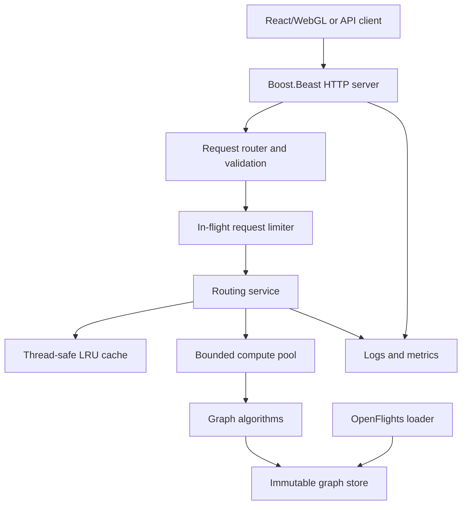

# Airport Routing Service Upgrade Brief

## Purpose

This document is an implementation brief for upgrading Vincent Do's existing **Shortest Path Between Airports** project into a portfolio-quality **C++ backend and systems project**.

The result should demonstrate the skills expected in early-career C++ systems, backend infrastructure, platform, and performance-engineering roles:

- Modern C++20
- Graph and data-structure design
- Asynchronous networking
- Concurrent request processing
- Backpressure and bounded resource use
- Thread-safe caching
- API design and error handling
- Unit, integration, concurrency, and performance testing
- Linux tooling, Docker, CI, observability, and reproducible benchmarks

The goal is **not** to make the project artificially distributed or to accumulate technologies. The goal is to turn an existing algorithm visualization into a well-engineered, measurable service.

## Known Current State

The current project is known to contain:

- C++ implementations of breadth-first search, Floyd-Warshall, and betweenness centrality
- A graph built from 1,000+ airports and their routes
- C++ unit tests
- A React/WebGL visualization

The repository itself was not available when this brief was written. Claude must inspect the actual repository before changing code and must treat the above as context rather than a complete description.

## Final Product

Build a single deployable application called **Airport Routing Service**:

1. A C++20 HTTP service loads the OpenFlights airport and route data into an immutable in-memory graph.
2. API clients request routes, airport information, reachability, and precomputed network statistics.
3. Asynchronous network I/O accepts requests without blocking.
4. CPU-bound route calculations run through a bounded compute pool.
5. A thread-safe LRU cache stores repeated route results.
6. Health, readiness, logging, and metrics make the service observable.
7. The existing React/WebGL client consumes the live API and visualizes returned paths.
8. Unit, integration, sanitizer, and load tests verify correctness and behavior under concurrency.
9. A benchmark report records real throughput, latency, memory use, and cache behavior.

The project should remain one service. Do not introduce microservices, Kubernetes, Kafka, Redis, or a relational database unless a concrete requirement emerges that cannot be solved appropriately inside this service.

## Recommended Technical Direction

### Core stack

- **Language:** C++20
- **Networking:** Boost.Asio and Boost.Beast
- **HTTP:** HTTP/1.1 JSON API
- **JSON:** Reuse the repository's existing JSON library; otherwise use `nlohmann/json`
- **Build:** CMake with `CMakePresets.json`
- **Tests:** GoogleTest integrated through CTest
- **Dependencies:** Reuse the existing package manager; if none exists, add one manifest-based solution such as vcpkg or Conan rather than vendoring dependency source manually
- **Container:** Multi-stage Docker build
- **Load testing:** `k6`, `wrk`, `hey`, or an equivalent reproducible tool
- **CI:** GitHub Actions
- **Primary platform:** Linux; preserve macOS/Windows compatibility when it does not complicate the design

Boost.Beast is intentionally lower-level than a full web framework. It gives the project credible networking and concurrency depth while still providing HTTP primitives. Do not copy a Beast example and leave all logic inside request handlers; create clear application boundaries.

### Non-goals

- Do not split the application into microservices.
- Do not add a database simply to claim database experience; the route graph is read-only and belongs in memory.
- Do not compute Floyd-Warshall or betweenness centrality synchronously inside request handlers.
- Do not spend most of the project on the WebGL interface.
- Do not claim scalability, latency, or throughput until it has been measured reproducibly.
- Do not replace correct existing algorithms without first establishing tests and a baseline.

## Target Architecture



### Component responsibilities

#### `OpenFlightsLoader`

- Parse airport and route files.
- Validate required fields.
- Normalize airport lookup keys.
- Reject or count malformed records without crashing startup.
- Produce a deterministic load report: accepted airports, accepted routes, rejected rows, duplicate codes, and missing route endpoints.

#### `GraphStore`

- Assign compact integer IDs to airports.
- Map IATA and/or ICAO codes to internal IDs.
- Store airport metadata separately from adjacency lists.
- Store routes as directed edges unless the source data explicitly indicates otherwise.
- Become immutable after startup so request-time reads require no graph lock.
- Expose read-only interfaces; do not return mutable internal containers.

#### `RoutingEngine`

- Preserve the existing correct algorithms behind clean interfaces.
- Use BFS for minimum-hop paths on an unweighted graph.
- Add bidirectional BFS only after the BFS baseline is tested and benchmarked.
- Optionally add Dijkstra for minimum geographic distance, using validated coordinates and clearly documented edge weights.
- Keep Floyd-Warshall for offline comparison, validation, or small test graphs. Do not run its O(V^3) work per request.
- Precompute betweenness centrality offline or during controlled startup, then serve stored results.
- Return structured results rather than formatted strings.
- Produce deterministic results when multiple equal-cost routes exist, using a documented tie-break rule.

#### `RouteCache`

- Implement a capacity-bounded LRU cache.
- Cache key should include source, destination, route mode, and a dataset/version identifier.
- Protect the cache with a mutex. A conventional LRU hit mutates recency order, so a simple `shared_mutex` read path is not automatically correct.
- Record hit, miss, insertion, and eviction counts.
- Make capacity configurable.
- Test duplicate concurrent lookups and eviction ordering.

#### `RoutingService`

- Validate domain inputs independently of HTTP parsing.
- Check the cache before scheduling computation.
- Submit CPU-bound work to a bounded compute pool.
- Enforce a configurable maximum number of in-flight route computations.
- Apply a queue wait timeout or reject excess work with an explicit overload response.
- Convert graph results into API response objects.
- Never hold a cache lock while running a graph algorithm.

#### HTTP server

- Use asynchronous Boost.Asio/Beast sessions.
- Set request-size, header-size, and idle-time limits.
- Parse and validate parameters before invoking the service layer.
- Return consistent JSON errors.
- Support request IDs for log correlation.
- Handle graceful shutdown on `SIGINT` and `SIGTERM`.
- Stop accepting new connections, finish or cancel bounded work according to documented behavior, and join worker threads.

## Proposed API

Prefix application endpoints with `/api/v1`.

### `GET /api/v1/airports/{code}`

Returns canonical airport metadata.

### `GET /api/v1/routes?source=ORD&destination=NRT&mode=hops`

Returns a route between two airports.

Supported initial mode:

- `hops`: minimum number of flight connections using BFS

Optional later mode:

- `distance`: minimum total geographic distance using Dijkstra

Example response shape:

```json
{
  "source": "ORD",
  "destination": "NRT",
  "mode": "hops",
  "algorithm": "bfs",
  "path": ["ORD", "SEA", "NRT"],
  "hops": 2,
  "distanceKm": 10123.4,
  "cache": "miss",
  "computeMicros": 184
}
```

`distanceKm`, `cache`, and `computeMicros` may be omitted until they are implemented accurately.

### `GET /api/v1/reachable?source=ORD&maxHops=2&limit=100`

Returns airports reachable within a bounded number of hops. Enforce conservative limits so one request cannot generate an unbounded response.

### `GET /api/v1/network/central-airports?limit=20`

Returns precomputed centrality results. It must not launch a full centrality computation for every request.

### Operational endpoints

- `GET /healthz`: process is alive
- `GET /readyz`: graph has loaded and the service can answer requests
- `GET /metrics`: Prometheus-compatible text or a documented JSON metrics format

### Error contract

Use a consistent error object:

```json
{
  "error": {
    "code": "UNKNOWN_AIRPORT",
    "message": "Airport code XYZ was not found",
    "requestId": "..."
  }
}
```

Required cases:

- `400`: malformed or missing parameters
- `404`: unknown airport or no matching route
- `405`: unsupported HTTP method
- `413`: request too large
- `429` or `503`: configured overload/backpressure response
- `500`: unexpected internal failure without exposing stack traces or local paths

## Concurrency Model

Use separate concerns for I/O and CPU work.

1. One `boost::asio::io_context` handles asynchronous sockets and HTTP sessions.
2. A configurable number of threads call `io_context::run()`.
3. A separate fixed-size compute pool runs route calculations.
4. A bounded admission mechanism prevents unlimited queued computations.
5. The graph remains immutable and can be read concurrently without locking.
6. The cache uses a narrow lock around cache bookkeeping only.
7. Metrics use atomics where appropriate and avoid global coarse locks.

Configuration should support at least:

- HTTP listening address and port
- I/O thread count
- Compute thread count
- Maximum in-flight computations
- Cache capacity
- Dataset paths
- Log level

Use environment variables and/or command-line flags. Validate configuration at startup and print a sanitized configuration summary.

## Suggested Repository Shape

Claude must adapt to the existing repository rather than blindly imposing this layout.

```text
/
  CMakeLists.txt
  CMakePresets.json
  Dockerfile
  README.md
  apps/
    airport_server/
  include/airports/
    domain/
    graph/
    routing/
    cache/
    service/
    http/
    observability/
  src/
    domain/
    graph/
    routing/
    cache/
    service/
    http/
    observability/
  tests/
    unit/
    integration/
    fixtures/
  benchmarks/
    scripts/
    results/
    README.md
  data/
    README.md
  docs/
    architecture.md
    api.md
  web/
    existing React/WebGL application
```

## Implementation Plan

### Phase 0: Repository audit

Before writing code, Claude must:

1. Read the entire repository structure, build files, README, tests, and entry points.
2. Run the current build and test commands exactly as documented.
3. Record which commands pass or fail before modification.
4. Identify the current graph representation, ownership model, algorithm interfaces, data-loader behavior, and UI integration.
5. Identify duplicated logic, global mutable state, hidden coupling, and algorithm behavior that lacks tests.
6. Produce a concise audit containing:
   - current architecture;
   - existing functionality worth preserving;
   - gaps relative to this brief;
   - proposed file-level changes;
   - risks or ambiguities requiring Vincent's decision.

Do not begin a wholesale rewrite during the audit.

**Phase 0 acceptance criteria**

- Existing build and test status is documented.
- The plan references actual repository files and symbols.
- Unknowns are stated rather than guessed.

### Phase 1: Stabilize the graph core

1. Add characterization tests around current BFS, Floyd-Warshall, centrality, and loader behavior.
2. Create domain types for airport IDs, airport metadata, route edges, and route results.
3. Encapsulate mutable global state.
4. Convert the final loaded graph to immutable/read-only request-time state.
5. Normalize airport code lookup and define deterministic tie-breaking.
6. Separate algorithm computation from rendering and console output.
7. Add malformed-input and disconnected-graph tests.

**Phase 1 acceptance criteria**

- Existing results remain correct on known fixtures.
- Algorithms can be called through clean C++ interfaces with no UI dependency.
- Tests cover same-source/destination, unknown airports, disconnected nodes, cycles, duplicate routes, and multiple equal-length paths.
- No algorithm returns references to mutable temporary data.

### Phase 2: Add the HTTP service

1. Introduce Boost.Asio/Beast through the repository's dependency mechanism.
2. Create asynchronous listener, session, router, request parsing, and response serialization components.
3. Implement `/healthz`, `/readyz`, airport lookup, and minimum-hop route endpoints.
4. Add domain-to-HTTP error mapping.
5. Add request IDs and basic structured logs.
6. Add shutdown handling.
7. Add API integration tests that start the server on an ephemeral port.

**Phase 2 acceptance criteria**

- The service starts, loads the graph, becomes ready, and answers valid requests.
- Invalid requests receive stable JSON errors and correct HTTP statuses.
- The service can shut down cleanly without detached threads.
- HTTP handlers contain no graph-algorithm implementation.

### Phase 3: Add bounded concurrency and backpressure

1. Separate I/O execution from CPU route computation.
2. Add configurable I/O and compute thread counts.
3. Add a bounded in-flight computation limit.
4. Define overload behavior and test it deterministically.
5. Ensure the immutable graph can be read concurrently.
6. Run unit and integration tests under ThreadSanitizer.
7. Add a concurrency integration test issuing many simultaneous route requests.

**Phase 3 acceptance criteria**

- No data races are reported by ThreadSanitizer on supported test scenarios.
- The number of queued/in-flight computations cannot grow without bound.
- The service stays responsive to `/healthz` while route work is active.
- Overload responses are explicit and measurable.

### Phase 4: Add caching and observability

1. Implement the bounded LRU route cache.
2. Add cache hit/miss/eviction tests.
3. Add request count, status count, active request, route latency, cache, graph-size, and startup-duration metrics.
4. Add log fields for request ID, endpoint, status, duration, cache result, and overload result.
5. Add `/metrics` and document each metric.
6. Confirm that metrics and logging do not expose filesystem paths or sensitive environment values.

**Phase 4 acceptance criteria**

- Repeated identical requests demonstrate verified cache hits.
- Cache capacity remains bounded.
- Metrics change as expected in integration tests.
- Route latency is measured around the correct service boundary.

### Phase 5: Benchmark and optimize

Establish a baseline before optimizing.

Benchmark at minimum:

- Cache disabled versus enabled
- Cold route versus repeated hot route
- One, 10, 50, and 100 concurrent clients
- BFS versus bidirectional BFS if bidirectional BFS is added
- Different compute-thread counts
- Different maximum in-flight limits

Record:

- Requests per second
- p50, p95, and p99 latency
- Error and overload rate
- CPU utilization
- Peak resident memory
- Cache hit rate
- Dataset load time
- Compiler, build type, hardware, operating system, dataset version, and exact benchmark command

Do not optimize from intuition alone. Use profiles to identify bottlenecks. If using `perf`, document the command and before/after evidence.

**Phase 5 acceptance criteria**

- `benchmarks/README.md` contains reproducible commands.
- Raw results are retained separately from the human summary.
- Every performance claim in README or resume bullets can be traced to a recorded run.
- Optimizations preserve correctness tests.

### Phase 6: Connect and refine the WebGL client

1. Replace locally computed or hard-coded route behavior with API calls.
2. Visualize the returned route on the existing globe.
3. Show source, destination, hop count, algorithm, and request latency.
4. Handle loading, invalid airport, no-route, overload, and server-unavailable states.
5. Keep the UI minimal; do not let visual polish delay backend completion.

**Phase 6 acceptance criteria**

- The UI consumes the deployed or locally running C++ service.
- User-visible errors correspond to API error codes.
- No graph algorithm is duplicated in the browser.

### Phase 7: CI, container, documentation, and deployment

Add CI jobs for:

- Debug and Release builds
- Unit and integration tests
- `clang-format` verification
- `clang-tidy` on project-owned code
- AddressSanitizer and UndefinedBehaviorSanitizer
- ThreadSanitizer in a separate compatible job
- Docker image build

Compiler warnings should be strict. Do not automatically apply `-Werror` to third-party headers.

Use a multi-stage Docker build and run as a non-root user where practical. Dataset licensing and provenance must be documented. Pin or checksum the dataset so benchmark results are reproducible.

The README should contain:

- Concise product description
- Architecture diagram
- Data-source attribution
- Build, test, run, and Docker commands
- API examples
- Concurrency and backpressure model
- Benchmark methodology and results
- Known limitations
- Screenshots or a short demo
- Link to the live deployment if one is maintained

## Testing Matrix

### Unit tests

- Airport code normalization
- Data-loader validation and malformed rows
- Duplicate airport and route behavior
- Directed-edge behavior
- BFS correctness
- Same source and destination
- Disconnected graphs
- Multiple equal-length paths and deterministic tie-breaking
- Floyd-Warshall comparison on small fixtures
- Dijkstra correctness if distance mode is added
- Cache insertion, hit, eviction, duplicate update, and capacity zero
- Configuration parsing
- Domain error mapping

### Integration tests

- Startup and readiness
- Valid airport lookup
- Valid route request
- Unknown airport
- Missing parameters
- Unsupported mode
- No route available
- Request-size rejection
- Concurrent requests
- Configured overload behavior
- Cache hit after repeated request
- Graceful shutdown
- Metrics reflect executed requests

### Dynamic analysis

- AddressSanitizer
- UndefinedBehaviorSanitizer
- ThreadSanitizer
- Optional parser fuzzing as a stretch goal

## Definition of Done

The project is portfolio-ready when all of the following are true:

- A clean clone can build and test through documented commands.
- The graph core is independent of the UI and HTTP layer.
- The C++ service exposes stable versioned endpoints.
- Requests are processed concurrently with bounded resource use.
- The graph is safely shared as immutable data.
- The route cache is correct, thread-safe, observable, and bounded.
- The service handles shutdown and overload intentionally.
- Unit, integration, sanitizer, and load tests pass.
- The WebGL client consumes the real API.
- A Docker image runs the service without local build tools.
- Benchmarks are reproducible and contain real measurements.
- README claims match implementation and recorded results.
- No Boeing code, data, architecture, protocol, or non-public knowledge is used.

## Resume Positioning After Completion

Recommended project name:

**High-Performance Airport Routing Service**  
`C++20, Boost.Asio, Boost.Beast, CMake, GoogleTest, Docker, React/WebGL`

Resume bullet templates—replace placeholders with verified results:

- Built a concurrent C++20 routing service exposing minimum-hop and network-analysis queries across 1,000+ airports through an asynchronous HTTP API.
- Designed an immutable graph store, bounded compute pool, backpressure, and thread-safe LRU cache, sustaining `[X]` requests/second at `[Y] ms` p95 latency under `[N]` concurrent clients.
- Added GoogleTest integration coverage, sanitizer validation, Docker packaging, CI, operational metrics, and a WebGL client consuming live routing results.

Do not force all three bullets onto the final resume if space is limited. Prefer two dense, measurable bullets.

## Instructions for Claude

1. Begin with Phase 0 and report the audit before making architectural changes.
2. Adapt this brief to the real repository; do not assume filenames or libraries exist.
3. Preserve working algorithms and UI behavior unless a tested replacement is justified.
4. Work phase by phase. Each phase should end with passing tests and a concise change summary suitable for a commit.
5. Keep changes reviewable. Avoid a single repository-wide rewrite.
6. Ask Vincent before making a choice that materially changes scope, dataset meaning, public API, or deployment cost.
7. Never invent benchmark results, user counts, scale claims, or test coverage.
8. Do not include confidential or proprietary Boeing material.
9. Prefer the simplest design that demonstrates the target engineering concept correctly.
10. If a requested feature conflicts with correctness, reproducibility, or bounded resource use, explain the conflict and propose a safer design.

## Primary References

- [Boost.Beast official documentation](https://www.boost.org/library/latest/beast/)
- [Boost.Asio threads and thread pools](https://www.boost.org/doc/libs/latest/doc/html/boost_asio/overview/core/threads.html)
- [CMake presets documentation](https://cmake.org/cmake/help/latest/guide/user-interaction/index.html#presets)
- [CMake GoogleTest integration](https://cmake.org/cmake/help/latest/module/GoogleTest.html)

